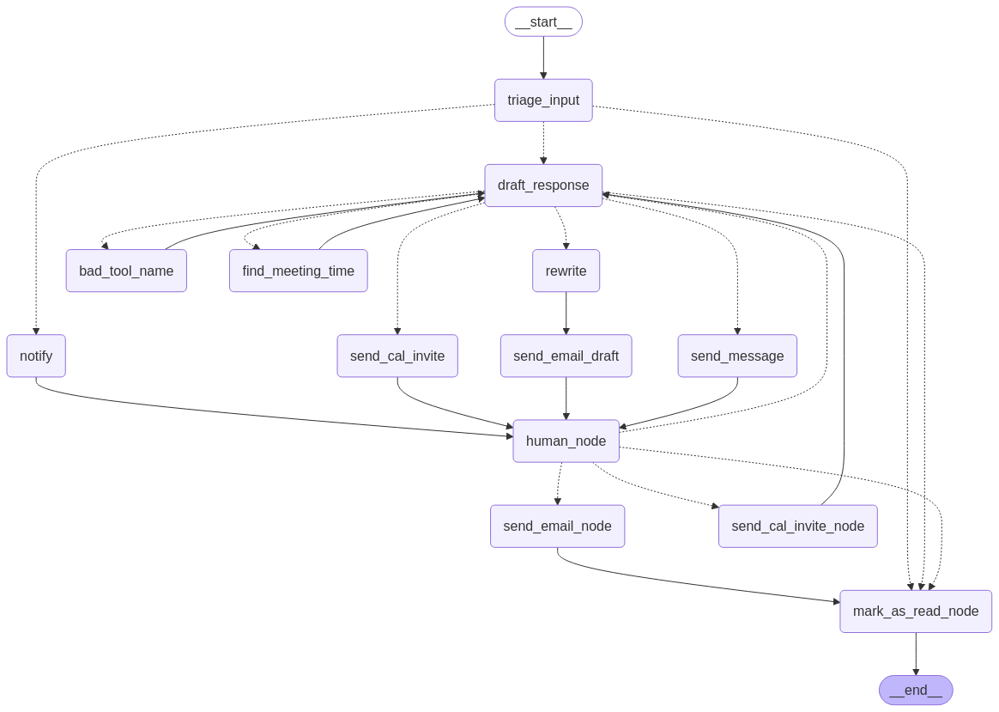

# AI Email Assistant – Forked Version

This repository is a personal fork of the [Executive AI Assistant (EAIA)](https://github.com/langchain-ai/executive-ai-assistant), an AI agent designed to function as an Executive Assistant. The purpose of this fork is to gain knowledge and expertise in the project by testing it and making slight tweaks while exploring its functionalities. This demonstrates my ability to implement and adapt similar AI-powered solutions for different users if required.

## LangGraph Visualization

This is a visualization of the LangGraph execution flow.




### Executive AI Assistant

Executive AI Assistant (EAIA) is an AI agent that attempts to do the job of an Executive Assistant (EA).

For a hosted version of EAIA, see documentation [here](https://mirror-feeling-d80.notion.site/How-to-hire-and-communicate-with-an-AI-Email-Assistant-177808527b17803289cad9e323d0be89?pvs=4).

## Purpose of This Fork

By working with this project, I aimed to:

- **Learn from an Existing AI Solution** – Studied the architecture and workflow of the EAIA to gain practical expertise.
- **Test and Explore** – Ran and tested the assistant's features while tweaking certain aspects to understand its flexibility.
- **Showcase Adaptability** – Demonstrated that I can implement similar AI-driven solutions and modify them according to different user needs.

## Features (As in the Original Project)

- **Email Management** – Organizes and automates email prioritization and responses.
- **Calendar Coordination** – Schedules, updates, and manages events and meetings.
- **Task Handling** – Keeps track of tasks, deadlines, and reminders.

## What Was Done in This Fork?

- **Tested the Features** – Ran and validated different functionalities to ensure a proper understanding of the system.
- **Minor Tweaks During Testing** – Made slight modifications while testing to explore adaptability.
- **Demonstrated Implementation Skills** – By successfully setting up and running the project, I have showcased my ability to work with and customize similar AI-powered assistants.

## General Setup

## ENV:
-   Clone this repository `git clone <repository-url>`
-   Initialize poetry with `poetry init -n`
-   Run `poetry config virtualenvs.in-project true` so that virtualenv will be present in project directory
-   Run `poetry env use <C:\Users\username\AppData\Local\Programs\Python\Python311\python.exe>` to create virtualenv in project (change username to your username)
-   Run `poetry shell`
-   Run `poetry install` to install requried packages
-   Create `.env` file and insert all keys: see `.env.example` file

### Set up credentials

1. Export Groq API key (`export GROQ_API_KEY=...`)
2. Enable Google
   1. [Enable the API](https://developers.google.com/gmail/api/quickstart/python#enable_the_api)
      - Enable Gmail API if not already by clicking the blue button `Enable the API`
   2. [Authorize credentials for a desktop application](https://developers.google.com/gmail/api/quickstart/python#authorize_credentials_for_a_desktop_application)
      1. Download the client secret. After that, run these commands:
      2. `mkdir src/.secrets` - This will create a folder for secrets
      3. `mv ${PATH-TO-CLIENT-SECRET.JSON} src/.secrets/secrets.json` - This will move the client secret you just created to that secrets folder
      4. `python scripts/setup_gmail.py` - This will generate another file at `src/.secrets/token.json` for accessing Google services.
4. Export LangSmith API key (`export LANGSMITH_API_KEY`)

### Configuration

The configuration for ai-email-assistant can be found in `src/email_assistant/config.yaml`. Every key in there is required. These are the configuration options:

- `triage_model`: model to make triage decision
- `draft_response_model`: model to draft a response
- `rewrite_email_model`: model to rewrite email
- `find_meeting_model`: model to find meeting schedules
- `reflection_model`: model to perform refleciton in reflection graphs. Reflection Graphs were not tested in this repo. 
- `email`: Email to monitor and send emails as. This should match the credentials you loaded above.
- `full_name`: Full name of user
- `name`: First name of user
- `background`: Basic info on who the user is
- `timezone`: Default timezone the user is in
- `schedule_preferences`: Any preferences for how calendar meetings are scheduled. E.g. length, name of meetings, etc
- `background_preferences`: Any background information that may be needed when responding to emails. E.g. coworkers to loop in, etc.
- `response_preferences`: Any preferences for what information to include in emails. E.g. whether to send calendly links, etc.
- `rewrite_preferences`: Any preferences for the tone of your emails
- `triage_no`: Guidelines for when emails should be ignored
- `triage_notify`: Guidelines for when user should be notified of emails
- `triage_email`: Guidelines for when the assistant should try to draft a response to an email

## Run locally

You can run this AI Email Assistant locally.
This is useful for testing it out, but when wanting to use it for real you will need to have it always running (to run the cron job to check for emails).
See [this section](#run-in-production--langgraph-cloud-) for instructions on how to run in production (on LangGraph Cloud)

### Set up AI Email Assistant locally

1. Run development server `langgraph dev`

### Ingest Emails Locally

Let's now kick off an ingest job to ingest some emails and run them through our local AI Email Assistant.

Leave the `langgraph dev` command running, and open a new terminal. From there, get back into this directory and virtual environment. To kick off an ingest job, run:

```shell
python scripts/run_ingest.py --minutes-since 120 --rerun 1 --early 0
```

This will ingest all emails in the last 120 minutes (`--minutes-since`). It will NOT break early if it sees an email it already saw (`--early 0`) and it will
rerun ones it has seen before (`--rerun 1`). It will run against the local instance we have running.

### Set up Agent Inbox with Local AI Email Assistant

After we have [run it locally](#run-locally), we can interract with any results.

1. Go to [Agent Inbox](https://dev.agentinbox.ai/)
2. Connect this to your locally running AI Email Assistant agent:
   1. Click into `Settings`
   2. Input your LangSmith API key.
   3. Click `Add Inbox`
      1. Set `Assistant/Graph ID` to `main`
      2. Set `Deployment URL` to `http://127.0.0.1:2024`
      3. Give it a name like `Local AI Email Assistant`
      4. Press `Submit`

You can now interract with AI Email Assistant in the Agent Inbox.

## Run in production (LangGraph Cloud)

These instructions will go over how to run AI Email Assistant in LangGraph Cloud.
You will need a LangSmith Plus account to be able to access [LangGraph Cloud](https://langchain-ai.github.io/langgraph/concepts/langgraph_cloud/)

If desired, you can always run AI Email Assistant in a self-hosted manner using LangGraph Platform [Lite](https://langchain-ai.github.io/langgraph/concepts/self_hosted/#self-hosted-lite) or [Enterprise](https://langchain-ai.github.io/langgraph/concepts/self_hosted/#self-hosted-enterprise).

## Advanced Options

If you want to control more of AI Email Assistant besides what the configuration allows, you can modify parts of the code base.

**Reflection Logic**
To control the prompts used for reflection (e.g. to populate memory) you can edit `src/email_assistant/reflection_graphs.py`

**Triage Logic**
To control the logic used for triaging emails you can edit `src/email_assistant/triage_task.py`

**Calendar Logic**
To control the logic used for looking at available times on the calendar you can edit `src/email_assistant/find_meeting_time.py`

**Tone & Style Logic**
To control the logic used for the tone and style of emails you can edit `src/email_assistant/rewrite_email.py`

**Email Draft Logic**
To control the logic used for drafting emails you can edit `src/email_assistant/draft_response.py`
